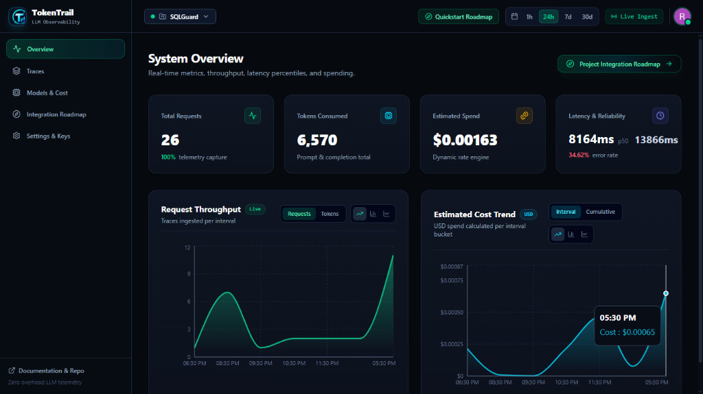
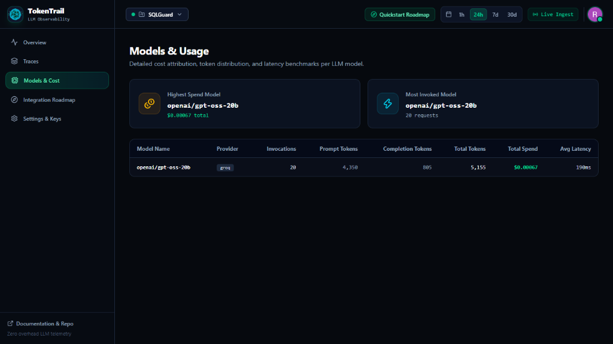
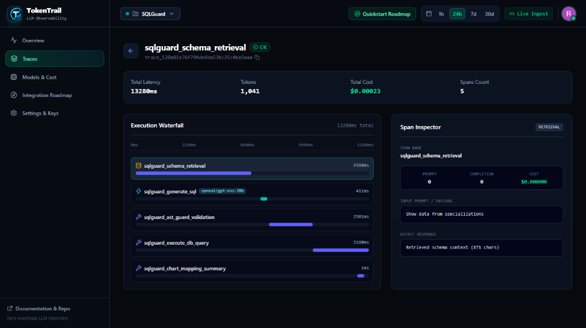
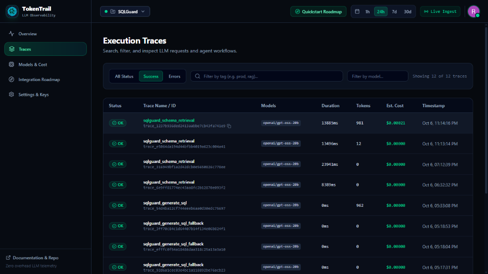
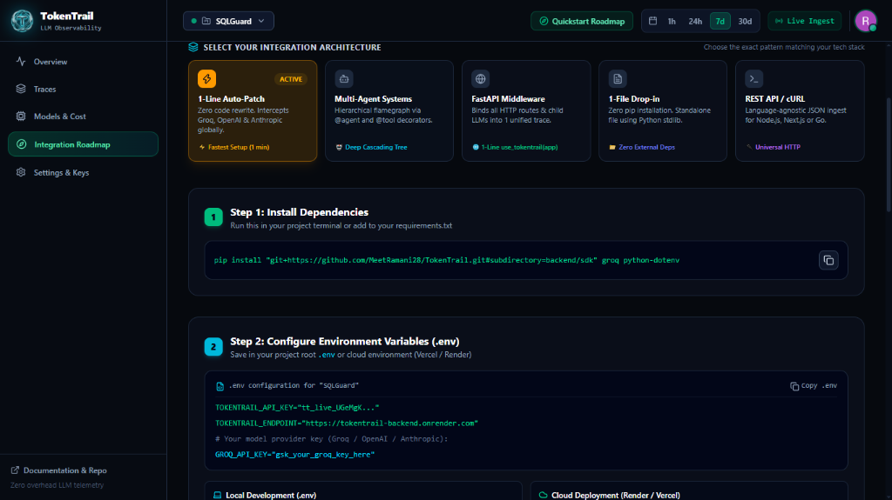
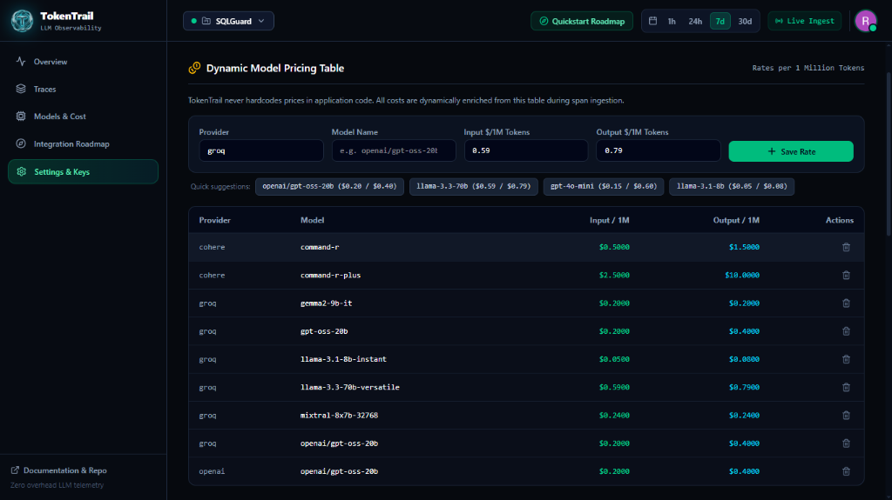
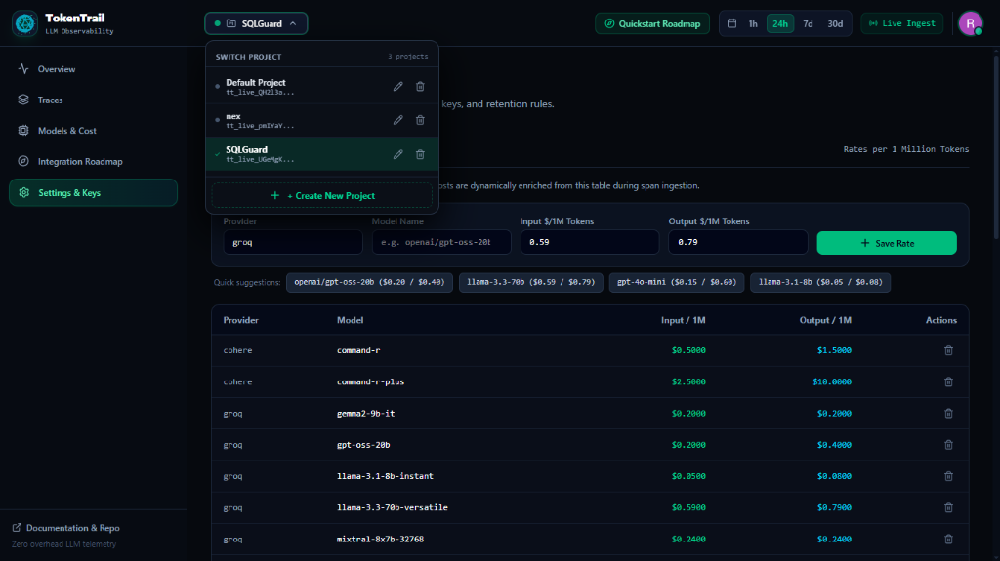

# TokenTrail ⚡
### Zero-Overhead, High-Precision LLM Observability & Cost Tracking Engine

[](LICENSE)
[](https://www.python.org/)
[](https://fastapi.tiangolo.com/)
[](https://react.dev/)
[](https://tailwindcss.com/)
[](https://www.typescriptlang.org/)
[](https://supabase.com/)
[](https://clerk.com/)
[](backend/benchmarks/raw/)

> **TokenTrail** is a self-hostable, production-grade LLM observability platform engineered for AI agents, RAG pipelines, and multi-step LLM workflows. Featuring sub-millisecond SDK tracing, real-time micro-cent cost tracking, dynamic model pricing, multi-span execution waterfalls, and multi-project workspace isolation.

---

## 📸 Product Tour & Live Platform Features

TokenTrail brings enterprise-grade telemetry into a sleek, zero-clutter developer experience. Below is a tour of the live production dashboard:

### 1. Real-Time Observability & KPI Analytics
Monitor aggregate health across projects with live micro-cent spend calculation, token consumption, P50/P95 latency percentiles, and error tracking.



- **Micro-Cent Spend Engine**: Precise cost calculation down to fractions of a cent (e.g. `$0.00045`) with dynamic Y-axis scaling.
- **Latency Percentiles**: Real-time P50 and P95 latency tracking across all incoming LLM requests.
- **Time-Series Graphs**: Interactive cost trends, latency distributions, and token consumption breakdowns across customizable windows (`1h`, `24h`, `7d`, `30d`).

---

### 2. High-Throughput Traces Explorer
Search, inspect, and analyze every LLM interaction, agent chain, and tool invocation with granular metadata.



- **Comprehensive Request Catalog**: View trace IDs, root spans, execution statuses (`Success` / `Error`), durations, total tokens, and computed cost.
- **Instant Search & Multi-Faceted Filters**: Quickly isolate slow queries, high-cost prompts, or failed chains.

---

### 3. Multi-Span Execution Waterfall & Flamegraph
Visualize complex, multi-agent workflows (e.g. Schema Discovery → SQL Generation → AST Validation → Query Execution → Chart Mapping) as an intuitive execution flamegraph.



- **Hierarchical Waterfall**: Visual timeline offsets, parent-child relationships, and color-coded span types (`chain`, `llm`, `guard`, `db`, `tool`).
- **Time-To-First-Token (TTFT)**: Track streaming performance and TTFT directly in the waterfall.
- **Deep Span Inspector**: Slide-over panel exposing model parameters, provider metadata, input prompts, completion responses, and custom attributes.

---

### 4. Model Inventory & Cost Analytics
Track token volume and financial footprint per provider and model in real-time.



- **Provider & Model Breakdown**: Compare usage across Groq, OpenAI, Cohere, Anthropic, and local models.
- **Token Granularity**: Distinct tracking of prompt tokens vs. completion tokens.
- **Average Latency & Spend**: Identify cost hotspots and latency bottlenecks across models.

---

### 5. Universal Quickstart & Live Integration Roadmap
Get up and running in under 2 minutes with interactive copy-paste snippets and immediate verification.



- **Multi-Tab Guides**: Zero-config setups for the Python SDK (`tokentrail`), raw REST Ingest API, and LangChain / LlamaIndex workflows.
- **One-Click "Send Test Ping"**: Send an immediate diagnostic span from the UI to verify end-to-end ingestion before writing code.

---

### 6. Dynamic Model Pricing Table
Never redeploy code just to update an LLM price change. TokenTrail decouples pricing from your application logic.



- **Runtime Dynamic Pricing**: Manage input and output rates per 1M tokens directly from the dashboard.
- **Quick Suggestions**: 1-click presets for popular models (`gpt-4o-mini`, `llama-3.3-70b`, `llama-3.1-8b`, `command-r`).
- **Ingestion-Time Enrichment**: Incoming spans are dynamically enriched with real-time costs during ingest.

---

### 7. Multi-Project & Multi-Tenant Workspaces
Isolate environments, teams, and applications with scoped API keys.



- **Project Switcher**: Seamlessly switch between projects (e.g. `SQLGuard`, `nex`, `Default Project`).
- **Scoped Ingestion Keys**: Generate and manage secure `tt_live_...` API keys with SHA-256 backend hashing.
- **Multi-Device Clerk Session Management**: Persistent login across mobile, tablet, and desktop.

---

## ⚡ Why TokenTrail?

| Feature | TokenTrail | Langfuse / LangSmith | Phoenix (Arize) |
|---|---|---|---|
| **SDK Overhead (p50)** | **13.6 µs (0.014 ms)** | ~0.5 – 2 ms | ~1 – 5 ms |
| **Host Application Safety** | **Strict Zero-Raise Policy** (bounded background queue) | Varies by SDK configuration | Varies |
| **Pricing Engine** | **Dynamic Runtime Database** (zero code hardcoding) | Hardcoded or static sync | Static configuration |
| **Deployment Footprint** | **Single process / Serverless friendly** (Runs free on Render/Supabase) | Multi-container Docker, ClickHouse, Redis | Docker / Python server |
| **Cold-Start Keep-Alive** | **Built-in 24/7 Keep-Alive Workflow** + In-App Ping | N/A | N/A |
| **Design Philosophy** | **Lean, high-speed LLM telemetry** without bloat | Complex prompt versioning & evals | Heavy ML/eval focus |

---

## 🏗️ System Architecture

```
┌────────────────────────────────────────────────────────┐
│               Your Host Application / Agent            │
└──────────────────────────┬─────────────────────────────┘
                           │ (Non-blocking bounded queue)
                           ▼
┌────────────────────────────────────────────────────────┐
│           TokenTrail Python SDK (`tokentrail`)         │
│   • p50 overhead: 13.6 µs   • Drop-safe on overflow     │
│   • Zero-raise policy       • Background thread worker  │
└──────────────────────────┬─────────────────────────────┘
                           │ (Batched HTTP POST /v1/ingest)
                           ▼
┌────────────────────────────────────────────────────────┐
│               FastAPI Ingestion Engine                 │
│   • SHA-256 API Key verification                       │
│   • Idempotent upserts via client-generated UUIDs      │
│   • Dynamic cost enrichment via ModelPricing database  │
└─────────────┬────────────────────────────┬─────────────┘
              ▼                            ▼
┌──────────────────────────┐  ┌──────────────────────────┐
│  PostgreSQL / Supabase   │  │   React 19 Dashboard     │
│  (Or SQLite for dev)     │  │   (Tailwind v4 + Vite)   │
└──────────────────────────┘  └──────────────────────────┘
```

---

## 🚀 Quickstart & Integration Options

TokenTrail offers flexible integration paths depending on your project architecture:

### Option A: ⚡ 1-Line Zero-Code Auto-Instrumentation (Recommended)
Add one line at the top of your application entrypoint. All OpenAI, Groq, Anthropic, and LiteLLM invocations across your entire codebase are automatically intercepted:

```python
# At the top of main.py or server.py:
import tokentrail.auto  # ⚡ Global Zero-Code Auto-Instrumentation

from groq import Groq

# Use your LLM client normally — zero wrapper code needed!
client = Groq()
response = client.chat.completions.create(
    model="llama-3.3-70b-versatile",
    messages=[{"role": "user", "content": "Explain AI agents in 1 line."}],
)
# TokenTrail automatically captured duration, tokens, model, and computed spend!
```

---

### Option B: 🤖 Multi-Agent Hierarchical Waterfall (`@agent` & `@tool`)
In multi-agent systems (e.g. Orchestrator ➔ Specialist ➔ Tools ➔ Database), decorate your functions. TokenTrail uses `contextvars` to automatically nest child tools and LLM completions into an execution flamegraph:

```python
import tokentrail.auto
from tokentrail import agent, tool


@agent(name="OrchestratorAgent", role="planner")
def run_pipeline(user_query: str):
    schema = fetch_schema()  # Nests under OrchestratorAgent
    return generate_sql(schema, user_query)


@tool(name="SchemaFetcher")
def fetch_schema():
    return ["users", "orders", "payments"]


@agent(name="SQLSpecialistAgent", role="coder")
def generate_sql(schema: list, prompt: str):
    # LLM calls inside here automatically nest under SQLSpecialistAgent!
    return client.chat.completions.create(
        model="llama-3.3-70b-versatile",
        messages=[{"role": "user", "content": f"Schema: {schema}. Write SQL: {prompt}"}],
    )
```

---

### Option C: 🌐 1-Line FastAPI / Web Middleware
For FastAPI, Starlette, or ASGI web servers. Every incoming HTTP request becomes a root trace, and all downstream agent runs or LLM calls executed during that request automatically attach as child waterfall spans:

```python
from fastapi import FastAPI
from tokentrail.middleware import use_tokentrail

app = FastAPI()

# ⚡ 1-Line Middleware & Context Propagation
use_tokentrail(app)


@app.post("/api/ask")
async def chat_endpoint(query: str):
    # Any LLM call here automatically binds to the HTTP POST /api/ask trace!
    res = client.chat.completions.create(
        model="llama-3.3-70b-versatile",
        messages=[{"role": "user", "content": query}],
    )
    return {"reply": res.choices[0].message.content}
```

---

### Option D: 📁 Standalone 1-File Drop-in (`tokentrail_setup.py`)
Don't want to install packages via pip? Download or save [`tokentrail_setup.py`](backend/sdk/tokentrail_setup.py) directly into your project root. Works standalone with pure Python standard library and zero external dependencies:

```python
import tokentrail_setup  # ⚡ Standalone Zero-Dependency Telemetry!
```

---

### Option E: 🛠️ Manual Spans (Custom Pipelines)
```python
from tokentrail import TokenTrail

tt = TokenTrail(api_key="tt_live_...", endpoint="https://tokentrail-backend.onrender.com")

with tt.span("sqlguard_pipeline", type="chain"):
    with tt.span("sqlguard_schema_retrieval", type="tool"):
        schema = fetch_db_schema()

    with tt.span("sqlguard_generate_sql", type="llm", model="openai/gpt-oss-20b") as s:
        sql = generate_sql(schema, user_query)
        s.set_tokens(prompt_tokens=850, completion_tokens=120)
```

### 4. Direct REST API Ingestion
You can ingest spans from any programming language via standard HTTP:

```bash
curl -X POST "https://tokentrail-backend.onrender.com/v1/ingest" \
  -H "Content-Type: application/json" \
  -H "X-API-Key: tt_live_your_project_key" \
  -d '{
    "spans": [
      {
        "trace_id": "c71a3370-9856-4357-ae78-b570889ec1b3",
        "span_id": "8f869ea7-d8d4-4a4f-83a3-488663806380",
        "name": "sqlguard_generate_sql",
        "span_type": "llm",
        "model": "openai/gpt-oss-20b",
        "provider": "groq",
        "prompt_tokens": 850,
        "completion_tokens": 120,
        "duration_ms": 190.5,
        "status": "success",
        "started_at": "2026-10-06T18:00:00Z",
        "ended_at": "2026-10-06T18:00:00.190Z"
      }
    ]
  }'
```

---

## 📊 Benchmark Results

All benchmarks executed on free-tier PostgreSQL via Supabase. Raw benchmark outputs are archived in `backend/benchmarks/raw/`.

| Benchmark Metric | Measured Result | Benchmark Target | Verdict |
|---|---|---|---|
| **SDK Overhead (per span, p50)** | **0.014 ms (13.6 µs)** | < 0.50 ms | ✅ **PASS (36x faster)** |
| **SDK Overhead (per span, p99)** | **0.068 ms (67.6 µs)** | < 2.00 ms | ✅ **PASS (30x faster)** |
| **Host Crash Impact (Backend Down)** | **0 errors (100% fail-safe)** | 0 errors | ✅ **PASS** |
| **Queue Overflow Drop Safety** | **200 drops logged, 0 app errors** | 0 errors | ✅ **PASS** |
| **PostgreSQL Upsert Idempotency** | **0 duplicate rows (10x resend)** | 0 duplicates | ✅ **PASS** |
| **Remote Ingestion Throughput** | **39.6 spans/sec** | > 20 spans/sec | ✅ **PASS** |

---

## 🛠️ Local Development & Setup

### Prerequisites
- Python 3.11+ and [`uv`](https://docs.astral.sh/uv/)
- Node.js 20+ and `npm`

### 1. Backend Setup
```bash
cd backend

# Create .env from template
cp .env.example .env

# Run development server (SQLite + hot-reload)
uv run python run.py dev

# Or run in production mode (PostgreSQL)
uv run python run.py prod
```

### 2. Frontend Setup
```bash
cd frontend

# Install dependencies
npm install

# Create .env from template
cp .env.example .env

# Run development dashboard
npm run dev
```

### 3. Run Quality & Test Suites
```bash
# Backend linting & typing
cd backend
uv run ruff check .
uv run mypy app
uv run pytest --cov=app

# Frontend typecheck & build
cd ../frontend
npm run build
```

---

## 🔒 Privacy & Security

- **Strict Zero-Raise Policy**: If the telemetry collector goes down or the network fails, the host application continues running with zero interruptions or raised exceptions.
- **SHA-256 API Key Storage**: Ingestion keys (`tt_live_...`) are hashed using SHA-256 before database storage.
- **Optional Content Capture**: Toggle `capture_content=False` in the SDK to record only token metrics, durations, and status codes while stripping all prompt texts.
- **Multi-Device Clerk Session Management**: Secure JWT verification with cross-device session synchronization.

---

## 📄 License

TokenTrail is open-source software licensed under the [MIT License](LICENSE).
Created and maintained with ❤️ by [Meet Ramani](https://github.com/MeetRamani28).
